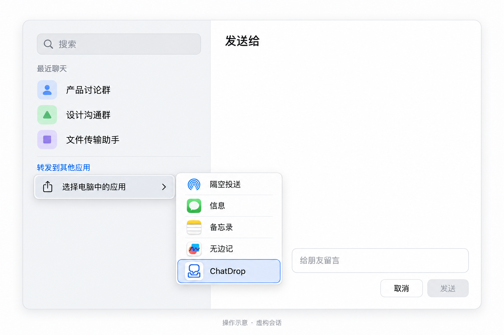
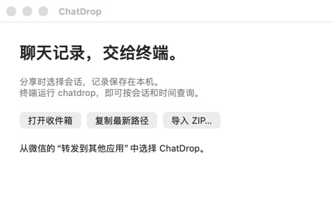
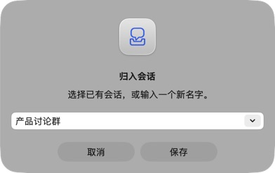

<p align="center">
  
</p>

<h1 align="center">ChatDrop</h1>
<p align="center"><strong>Turn selected WeChat messages into a local conversation archive your AI tools can query.</strong></p>
<p align="center">
  <a href="https://github.com/Daily-AC/chatdrop/releases/latest">Download for Mac</a> ·
  <a href="README.md">简体中文</a> · English ·
  <a href="docs/cli.md">CLI reference</a> ·
  <a href="https://github.com/Daily-AC/chatdrop/issues">Report an issue</a>
</p>

What did a customer ask for? Which decisions did your team make last week? Can a
newly downloaded video fill a gap in an earlier export?

Share the messages you need with ChatDrop and choose their conversation. Then let
an AI tool with shell access query by conversation, date, or keyword and retrieve
the original text and attachments.

## See it in action

Select messages in WeChat, then choose ChatDrop from the sharing menu:

<p align="center">
  
</p>

<sub>AI-generated illustration with fictional conversation names.</sub>

<table>
  <tr>
    <td align="center" width="55%"></td>
    <td align="center" width="45%"></td>
  </tr>
  <tr>
    <td align="center">Share from WeChat, or import a ZIP directly.</td>
    <td align="center">Choose an existing conversation or enter a new name.</td>
  </tr>
</table>

<sub>Captured from the running app. The conversation name is synthetic.</sub>

## What you can do

- **Keep related exports together.** Name a conversation once and select it on later
  shares. Renaming preserves its identity and history.
- **Reuse matching messages.** Later exports can fill missing images or videos without
  adding another copy of a matching message.
- **Give agents precise access.** Query multiple conversations, dates, senders, or
  keywords. Get JSON, context, and local attachment paths.
- **Check the originals.** Keep ZIPs, transcripts, and source links on your Mac so you
  can verify an AI summary.

ChatDrop processes files you explicitly share or import. It needs no WeChat database
keys and does not monitor chats in the background.

## Download and get started

**[Download the latest Mac release](https://github.com/Daily-AC/chatdrop/releases/latest)**

| Component | Requirements |
| --- | --- |
| Mac app | Apple Silicon; targets macOS 14+, tested on macOS 26.6.2 |
| CLI | Python 3.9+, no third-party Python dependencies |
| Other platforms | Intel Mac, Windows, and Linux are not yet fully supported and verified |

### 1. Install and enable sharing

Unzip the release, copy `ChatDrop.app` into Applications, and launch it once.

If it is missing from WeChat's menu, enable ChatDrop in System Settings' Sharing
extensions. The initial release is not notarized; first launch may require
**System Settings → Privacy & Security → Open Anyway**.

### 2. Share messages and choose a conversation

In WeChat, select messages and choose **转发到其他应用 → 选择电脑中的应用 → ChatDrop**.
Enter or select a conversation name and save. Choose the same conversation for later
exports. You can also import a WeChat ZIP directly in the app.

### 3. Query with your AI tool

Install the CLI from the extracted release folder:

```bash
bash scripts/install-cli.sh
```

Add `~/.local/bin` to `PATH`. Then ask an agent with shell access:

> Use chatdrop to read Product group's messages from last week. Summarize the
> decisions and unresolved questions, and include the original message IDs.

Or run the commands yourself:

```bash
# List conversations
chatdrop conversations

# Read all messages from two conversations within a date range
chatdrop search \
  --conversation 'Product group' \
  --conversation 'Design group' \
  --from 2026-09-01 --to 2026-09-16 --all

# Find keywords, context, and attachments
chatdrop search 'release' --conversation 'Product group'
chatdrop context '<message-id>' --radius 3
chatdrop attachments '<message-id>'
```

Queries import new receipts automatically. Keywords are optional, date-only bounds
include both full days, and results are paginated unless `--all` is specified.
See the [CLI reference](docs/cli.md).

## Reimports and missing attachments

Suppose an initial export has 9 messages, including a video that was not downloaded.
After downloading it, share just that message again and select the same conversation:

| | Initial import | After importing the video |
| --- | ---: | ---: |
| Conversation messages | 9 | 9 |
| Missing attachments | 1 | 0 |

This case has been verified with real exports. Matching uses conversation, sender,
time, body, and available attachment evidence—not native WeChat message IDs. Equal
messages within one export retain their occurrences. Identical same-minute messages
in separate exports can remain ambiguous. Original files are retained; see
[storage and matching rules](docs/architecture.md).

## FAQ

**Does it read my entire WeChat history?**

No. It processes only the ZIPs you explicitly share or import.

**Does it upload chats?**

ChatDrop itself does not upload chats. If an external AI tool reads the archive,
that tool's data handling applies.

**Why is an image or video missing?**

WeChat may omit media that has not been downloaded. Download it and share the
matching message to the same conversation so ChatDrop can attempt to fill it.

**Why does the share menu still show an old icon after an update?**

Fully quit WeChat with `⌘Q` and reopen it. Closing a window does not end the process.

**Does it detect the group name automatically?**

The observed export format does not supply a stable group ID. Conversation names
are local archive labels that you choose.

## Development and feedback

Requires macOS Command Line Tools, Swift, and Python 3.9+:

```bash
bash scripts/build.sh
python3 -m unittest discover -s tests -v
```

The app is written to `build/ChatDrop.app`. Please use synthetic or redacted samples
when [contributing](CONTRIBUTING.md); do not upload private chats, databases, or credentials.

If ChatDrop helps you, a Star and practical feedback are welcome.

[MIT license](LICENSE)
